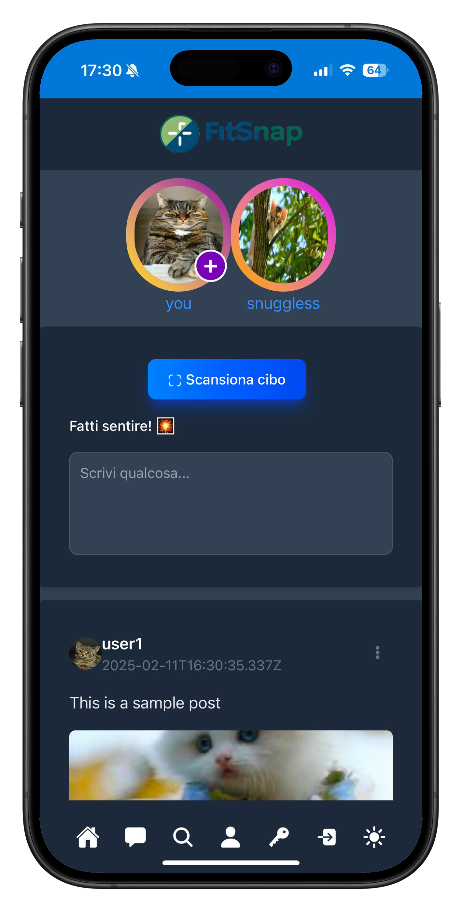

# Fitsnap

Fitsnap is an app that allows users to photograph food or scan barcodes of grocery products.
By photographing the food, an AI analyzes it and estimates the calories.
Similarly, by scanning the barcode, a search is performed using the OpenFoodFacts API to get the exact calories.
This information and photos are then saved to the user's profile, who can decide whether to share them with everyone in an social-style feed.
The app thus has a strong social component but is based on fitness.

## Features

- **Food Photography**: Take photos of your food and get an AI-based calorie estimate.
- **Barcode Scanning**: Scan barcodes of grocery products to get exact calorie information from OpenFoodFacts.
- **User Profiles**: Save your food photos and calorie information to your profile.
- **Social Sharing**: Share your food photos and calorie information with others in a social feed.

## Development server

Run `ng serve` for a dev server. Navigate to `http://localhost:4200/`. The application will automatically reload if you change any of the source files.

## Code scaffolding

Run `ng generate component component-name` to generate a new component. You can also use `ng generate directive|pipe|service|class|guard|interface|enum|module`.

## Build

Run `ng build` to build the project. The build artifacts will be stored in the `dist/` directory.

## Running unit tests

Run `ng test` to execute the unit tests via [Karma](https://karma-runner.github.io).

## Running end-to-end tests

Run `ng e2e` to execute the end-to-end tests via a platform of your choice. To use this command, you need to first add a package that implements end-to-end testing capabilities.

## Further help

To get more help on the Angular CLI use `ng help` or go check out the [Angular CLI Overview and Command Reference](https://angular.dev/tools/cli) page.
